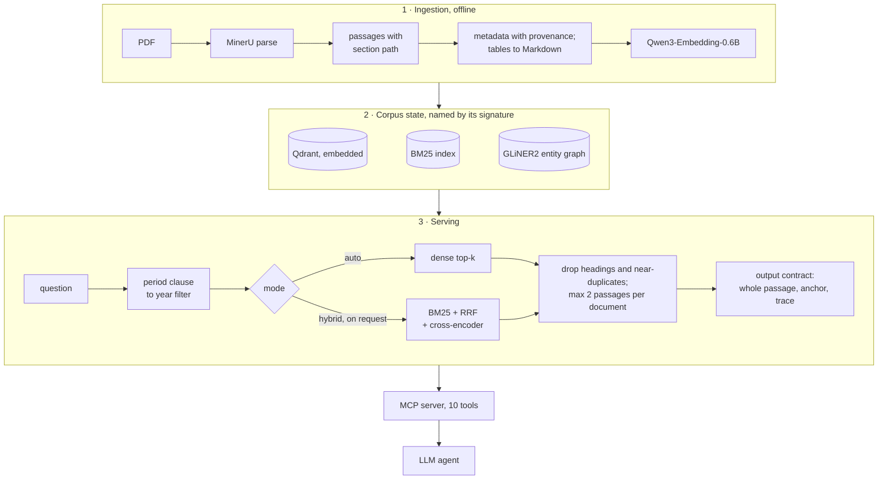

# quant-rag

**Retrieval over a closed library of quantitative-finance research, where every retrieval
choice is settled by a paired measurement and every citation can be checked without a
language model.**

[](https://github.com/Elias-outofsample/quant-rag/actions/workflows/ci.yml)


**418 documents** (papers, working papers, books; 1971–2026) · **26,120 passages** ·
**10 MCP tools** · **85 ms** median search, warm · **546 tests** that run without the corpus

An LLM agent asks questions about market microstructure, volatility models, backtest
statistics or portfolio construction. The server answers with passages that arrive
**whole** (never cut inside a formula, a table row or a word), each with a **citable
source**, a character-level **anchor** into the document's canonical text, and a **trace**
naming the exact server, corpus and configuration that produced it.

The engine itself is deliberately plain: dense retrieval on Qwen3 embeddings in an embedded
Qdrant. The work is in the measurement behind it: two benchmark families built against the
known-item bias, an LLM judge whose accuracy and noise are measured on every run, placebo
arms, paired bootstrap confidence intervals, and a written protocol before each major
experiment.
Several popular techniques were measured on this corpus, and most of them were **rejected**.

## Results at a glance

Paired differences in nDCG@10 (same questions in both arms), 95 % bootstrap CI;
`*` = the interval excludes zero. Full protocols and tables: [docs/evaluation.md](docs/evaluation.md).

| Question | What was measured | Decision |
|---|---|---|
| Does hybrid BM25 + RRF + cross-encoder beat dense? | Best configuration on a hand-written known-item bench (0.935 vs 0.853), but **−0.140 [−0.240, −0.043]\*** on the first leak-controlled natural-language bench | dense by default; hybrid only on request, for remembered identifiers |
| Can a rule-based router pick the right path? | +0.021 [+0.002, +0.050]\* on the 65 calibration questions, then −0.019 [−0.041, +0.002] on the 130-question bench that followed (−0.027 on its 90 unseen questions); a perfect router would add +0.055 | `auto` = dense; the router's detector now only logs |
| RRF fusion of dense and BM25 (14 variants) | −0.088 [−0.124, −0.054]\* | rejected |
| `bge-reranker-base` on the dense pool | −0.092 [−0.148, −0.033]\* | reranking off in dense mode |
| `Qwen3-Reranker-0.6B` on the dense pool | **+0.070 [+0.018, +0.125]\***, R@1 0.25 → 0.37, at 15 s median per query | not shipped; reranking only the top 10 keeps half the gain at 3.3 s |
| Re-embedding every passage with a clean, consolidated title | +0.031 [+0.003, +0.059]\*; questions whose gold passage falls outside the top 50: 39 → 26 | adopted |
| Filtering by publication year on dated questions | **+0.100 [+0.029, +0.184]\*** | adopted; a period written in the question ("published before 2010") is parsed into the filter: 15/15 detected, 0 false positives on 160 other questions |
| Fusing entity-graph hits into the ranking | −0.105 [−0.135, −0.074]\* | rejected; the graph stays a separate exploration tool |
| Served passages cut inside a formula, table row or word | 178 of 760 → **0**, for +14.1 % context | output contract |
| Citation check, no language model involved | 50/50 real quotes found, **0/50** one-word alterations accepted | `verify_citation` |
| Questions whose answer is not in the corpus | 20/20 abstentions, 0 fabrications | answer prompt |

## Try it in 30 seconds — no corpus, no model download

```bash
git clone https://github.com/Elias-outofsample/quant-rag && cd quant-rag
python3 -m venv .venv && .venv/bin/pip install -e .     # Python 3.12+
.venv/bin/python rag/demo.py
```

The demo runs the real serving functions on one synthetic document (only the storage layer
is swapped for an in-memory text):

```text
1. The output contract: a passage arrives whole, or cleanly interrupted
cap  325 (inside the display formula)
   raw cut      … \kappa (\theta - s_t)\,dt + \sigma\, dW_t,       breaks: an open $$ block
   contract cut …$ is where the spread returns after a shock.      breaks: nothing · 678 characters announced as remaining
cap  752 (inside a table row)
   raw cut      …A | 0.35 | 0.00 | 0.12 | 1.98 |⏎| B | 0.08 |      breaks: half a table row
   contract cut …-|---|---|⏎| A | 0.35 | 0.00 | 0.12 | 1.98 |      breaks: nothing · 209 characters announced as remaining

2. Quote verification, without a language model
   copied from the passage              found · offsets [376, 467] · exacte
   retyped: spacing, hyphen, capitals   found · offsets [376, 467] · exacte après normalisation
   one word changed (more -> less)      NOT found · closest passage: similarity 0.933, 2 word edits
   stitched from two places             NOT found · closest passage: similarity 0.833, 4 word edits

3. The query side: publication periods and exact tokens
   'volatility targeting, according to papers published between 2015 and 2020'
      -> year_min=2015 year_max=2020, embedded query: 'volatility targeting'
```

## How it works



Every step is described, with its measured cost, in [docs/architecture.md](docs/architecture.md).
The promises made on what is served are in [docs/output-contract.md](docs/output-contract.md).

## What a served passage looks like

Real output of `search_documents` (the server's labels are French: `citer` = cite as,
`ancre` = anchor, `interne` = internal keys, `qualité` = known defects of the passage):

```text
routage: dense — dense par défaut (calibration v3 : aucune règle ne bat le dense) · rerank: non · dense_top1=0.719 · 12406 ms
trace: request_id=8a7bdb351ec64fbb · serveur 1.4.0 · contrat 1.0.0 · corpus e1bdf36e2e · config aa5531c56ba9 · fenêtre 10000 c.

[1] cosine=0.719
    citer   : Ding et al. (2025) — Deep Learning Option Pricing with Market Implied Volatility Surfaces, p. 3
    section : III. RESULTS
    interne : chunk_id=chunk-169b5be73892b3f3 · document_id=doc-96437e7c996bb218 · mixed (clés de travail, ne pas citer)
    ancre   : doc-96437e7c996bb218 · caractères 10861–13884 (exacte) · sha256:c41346f98382
    qualité : has_html_tags
```

The 12.4 s of this first call include loading the embedding model; warm searches take
75–89 ms. The `ancre` line is what `verify_citation(document_id, quote)` checks a quote
against: character offsets in the canonical text of the document and the SHA-256 of that
text, so an anchor rebuilt on a different text is detected.

## The ten MCP tools

Measured on the running server over JSON-RPC.

| Tool | What it returns | Latency |
|---|---|---:|
| `search_documents` | ranked passages, with source, anchor and trace; filters by year and author | 84 ms |
| `get_passage` | one passage with its neighbours, never truncated mid-structure | 363 ms |
| `list_documents` | bibliography, filtered by author, period or text | 1.8 ms |
| `timeline` | how a topic evolves, grouped by publication year | 454 ms |
| `verify_citation` | found / not found, offsets, and the closest match when not found | 83 ms |
| `verify_citations` | the same, in batch | 156 ms |
| `corpus_status` | collection, counts, backend, device, contract, provenance | 2.7 s |
| `search_graph` | passages mentioning the entities of a query | 288 ms |
| `expand_entity` | typed neighbours of an entity (`depends_on`, `uses_method`, …) and co-mentions | 17 ms |
| `connect_entities` | passages and documents where two entities meet | 181 ms |

## How the evaluation is built

The first benchmark was the usual one: 25 questions written by hand while looking at the
passage that answers them. It measured an IDF-weighted **lexical leak** of the question into
its answer of 0.533 at the median and 0.916 at worst: retrieval on those questions is
string matching. It crowned the hybrid pipeline, and that verdict reversed on questions
worded the way a practitioner asks them. The benchmarks that followed are built against
that bias:

- **Question factory.** An LLM drafts a question from a passage as a practitioner would ask
  it; a second call rewrites it *without seeing the passage*; a leak score above 0.42 (the
  first quartile of the hand-written set) sends it back with the offending terms named; a
  verifier rejects questions that are unanswerable, not self-contained, or answered equally
  well by many other passages. The rejection rate is itself a finding: 12 % of table
  questions survive, against about a third of text questions.
- **Negative questions** name a source that is provably absent: every spelling of it is
  checked absent from the corpus text. The retriever is only ever used to *refute* a
  negative question, never to certify one.
- **Two score families, never merged.** Retrieval (nDCG@10 with graded gains, recall, MRR)
  needs no judge and stays valid when the judge model changes. Generation (groundedness,
  coverage of reference facts extracted before any answer existed) is judged; abstention is
  an exact string match.
- **The judge is measured on every run**: sentinel answers with a known correct grade
  (verbatim gold, off-topic, fluent but unsupported, wrongful refusal) give its accuracy
  (0.889 on the v3 baseline), and a double-graded sample gives its noise floor. Generator
  and judge are different models.
- **Placebo arms.** Regenerating the *same* configuration left only 55 % of answers
  identical and produced a "significant" +0.118 [+0.029, +0.235] change in fabrications on
  one family, with no variable changed. Since then both arms of a comparison are drawn in
  the same run, and a difference whose interval overlaps the placebo's is not reported as
  a result.
- **Instruments are proven before use.** The in-memory dense matrix used to run experiments
  in parallel reproduces Qdrant's top 50, in the same order, on 155/155 questions; replaying
  the old bench in the new code reproduces the published numbers with a maximum deviation of
  0.00.
- **Written protocol first.** The larger experiments start from a dated pre-registration
  (question, metric, decision rule) and end with a report and a verdict: keep, reject, or
  keep as experimental.

## Engineering

- **Explicit corpus state.** The document set, the overlays (deduplication, Markdown tables)
  and the consolidated titles hash to a corpus signature. The corpus is frozen between batches; unfreezing requires a
  written reason, kept in the history. The BM25 index file is named by that signature, and
  a check proves that production and benchmark serve the same index.
- **Ingestion without an operator.** A batch driver runs eight steps per PDF (parse, survey,
  diagnosis, import, registry and index updates, entity graph, retrieval probes, commit),
  holds an exclusive lock, survives a `kill -9`, and rolls an import back symmetrically.
  On a real 6-page paper: import in 25.9 s, zero LLM calls.
- **One home per decision.** The Qdrant backend (embedded or server), the served window,
  the model prices used for cost accounting: each lives in one module, and tests fail if a
  literal copy reappears elsewhere.
- **Installation check.** `verifier_installation.py` names every artefact the served path
  depends on, checks coherence rather than presence (index and collection counts against the
  registry, unresolved LFS pointers), says how to rebuild each one, and exits non-zero if one
  is missing.
- **Tests.** 674 tests; 546 run in CI without the corpus; those that read the private corpus
  are skipped with the missing path ([rag/conftest.py](rag/conftest.py)).

## Repository layout

```text
rag/
  quant_rag.py              retrieval: period parsing, routing, dense / hybrid, filters, CLI
  mcp_server.py             MCP server, ten tools
  contrat.py                output contract: safe cut, quality flags, anchor and trace lines
  citation.py  ancrage.py   quote verification; passage anchoring in the canonical text
  graph_search.py           entity-graph queries: mentions, neighbours, meeting points
  reranking.py              cross-encoder and Qwen3 rerankers
  qdrant_backend.py         embedded or server Qdrant, one home for the choice
  build_index.py            rebuild the collection from the export and the overlays
  corpus_overlay.py         deduplication, tables and titles overlays, applied wherever the corpus is read
  gel_corpus.py             corpus freeze, with its history
  verifier_installation.py  what the served path needs, and how to rebuild it
  demo.py                   corpus-free tour of the served surface
  ingestion/                parse, inspect, import, roll back; batch driver; registry
  metadata/ titles/ tables/ graph/    corpus curation passes
  benchmark/                about 100 experiment scripts and their tests (see its README)
  agents/rag-scout.md       minimal system prompt for the agent consuming the MCP tools
src/                        parsing and lexical primitives (see NOTICE.md)
tests/                      tests of the two original parsing modules in src/, and of the demo
docs/                       architecture, evaluation, output contract
```

## Running it

```bash
uv venv --python 3.12 .venv
VIRTUAL_ENV=.venv uv pip install -e ".[dev]"
.venv/bin/python -m pytest -n auto -rs     # no corpus needed; corpus tests report what is missing
```

Serving queries needs the model extras (`.[models]`: torch, sentence-transformers) and a
corpus state on disk: parsed documents, the vector export and the overlays under `data/`
and `rag/`. None of it is distributed (see below). With a corpus in place:

```bash
.venv/bin/python rag/build_index.py                                    # embedded Qdrant collection
.venv/bin/python rag/quant_rag.py "square-root law of market impact"
.venv/bin/python rag/quant_rag.py "cointegration test" --year-max 2000
.venv/bin/python rag/quant_rag.py --timeline "rough volatility"
claude mcp add quant-rag -- "$PWD/.venv/bin/python" "$PWD/rag/mcp_server.py"
```

## Scope

- **Not distributed:** the corpus (third-party copyrighted documents) and everything derived from it:
  vectors, BM25 index, entity graph, consolidated metadata, benchmark questions and per-run
  results. Test fixtures that came from the corpus were replaced by structure-preserving
  scrambles; the three short quotes kept for the citation tests are bibliographic-length.
- **Research log kept private:** about forty dated pre-registrations and reports, in French,
  quote the corpus. Code comments that point to `docs/…` or `RAPPORT-…` files refer to it.
- **Language:** identifiers, comments and test names are mostly in French, the working
  language of the project; the documentation is in English.
- **LLMs:** none on the served path. Language models only draft, launder and verify benchmark
  questions and judge answers (Mistral small and medium; Gemini once, as a separate
  instrument).
- **Hardware:** developed and measured on an Apple M4 with 16 GB (MPS); CPU works, slower.

Stack: Python 3.12 · Qdrant · Qwen3-Embedding-0.6B · BM25 · bge / Qwen3 rerankers ·
GLiNER2 · MinerU · Model Context Protocol · NumPy.

## License

All rights reserved. The code is published for reading and review; see [LICENSE](LICENSE)
and, for the provenance of `src/`, [NOTICE.md](NOTICE.md).
